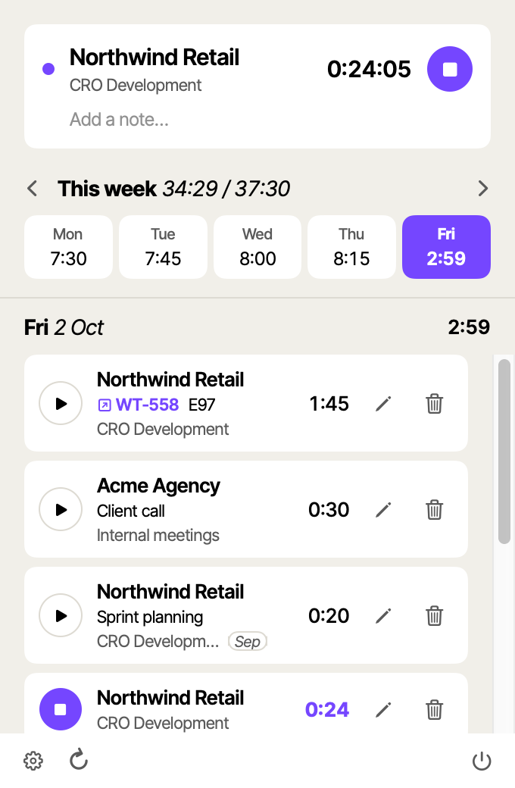
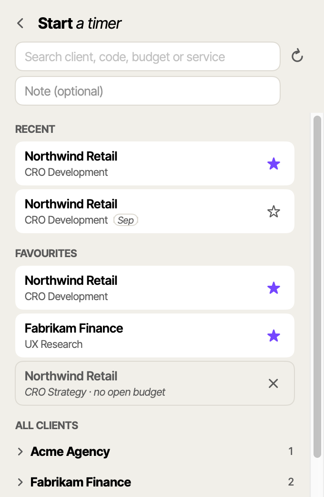
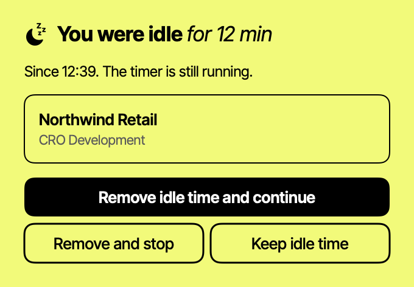

<p align="center">
  
</p>

<h1 align="center">Tempo</h1>

<p align="center">A small, native macOS menu bar timer for <a href="https://productive.io">Productive</a>.</p>

<p align="center">
  <picture>
    <source media="(prefers-color-scheme: dark)" srcset="docs/images/main-dark.png">
    
  </picture>
  &nbsp;
  <picture>
    <source media="(prefers-color-scheme: dark)" srcset="docs/images/picker-dark.png">
    
  </picture>
</p>

<p align="center">
  
</p>

## Install

Paste this in Terminal:

```sh
curl -fsSL https://raw.githubusercontent.com/NoeFabris/tempo/main/install.sh | sh
```

The script installs the latest release into `~/Applications` and opens Tempo. It needs no admin rights,
and macOS shows no security dialog. Run it again at any time to reinstall. Requires macOS 14 or later.

## Connect your Productive account

Tempo needs two values: a personal access token and your organisation ID.

### 1. Generate a personal access token

1. In Productive, go to **Settings › API integrations**.
2. Select **Generate new token**.
3. Set the access level to **Read/Write**. Tempo creates and edits time entries, so a read-only token
   does not work.
4. Hover over the token name to show the token, then copy it.

Copy the token immediately: Productive does not show it again. If you lose it, generate a new one.

### 2. Find your organisation ID

The organisation ID is a number. You can find it in two places:

- **Settings › API integrations**, on the same page as the token.
- **The address bar.** It is the number directly after `app.productive.io/`. For example, in
  `https://app.productive.io/12345-acme/…` the organisation ID is `12345`.

### 3. Paste both values into Tempo

On first launch, Tempo opens the **Connect Productive** screen. Paste the token into **API token** and
the number into **Organisation ID**, then select **Test connection**. When the values are correct, Tempo
shows **Connected as** and your name. To change them later, open the popup and go to Settings.

### Good to know

- The token has the same access as your Productive user. Tempo shows only the services you can track
  time on.
- The token does not expire. It stops working when you revoke it, when you change your Productive
  password, or when your user is deactivated. Generate a new token and paste it into Tempo.
- Turning two-factor authentication on or off does not affect the token.

Sources: [API access with personal access tokens](https://help.productive.io/en/articles/5440689-api-access-with-personal-access-tokens),
[Productive API authorization](https://developer.productive.io/guides/authorization),
[finding your organisation ID](https://help.productive.io/en/articles/6009276-logging-in-using-single-sign-on-sso).

## Features

- **Menu bar timer.** `[▶ 0:45]`: click ▶ to start or stop, click the time to open the popup. ▶ continues
  your last task.
- **The week at a glance.** Day totals, your weekly target and the entries of the selected day. Edit the
  time, note, service or date, or add an entry. The most recently tracked entry is first, with a `Last` tag.
- **One entry per item.** Entries with the same day, service and note merge into one: Tempo adds up the
  time and deletes the copies in Productive. A new start on the same item continues today's entry.
- **Find a service fast.** Your two most recent services, your favourites, and a search in all services
  you can track: by client, code, budget or service.
- **Monthly budgets.** A favourite moves to the new month's budget after one confirmation. A small tag
  (`Sep`) marks a service from last month's budget.
- **Calendar meetings.** Meetings from the calendar connected in Productive show under the day. + logs one.
- **Idle detection.** Like Harvest: when you come back, remove the idle time and continue, or stop.
- **Automatic updates.** A new version installs in the background while the popup is closed. The timer
  keeps running.
- **Native.** Swift, no web runtime, light and dark mode.

The token is stored in `~/Library/Application Support/Tempo/token`, readable only by you. Tempo sends it
only to `api.productive.io`.

## Development

Build, test and project layout: [`docs/development.md`](docs/development.md).
Releases: [`docs/release.md`](docs/release.md).
